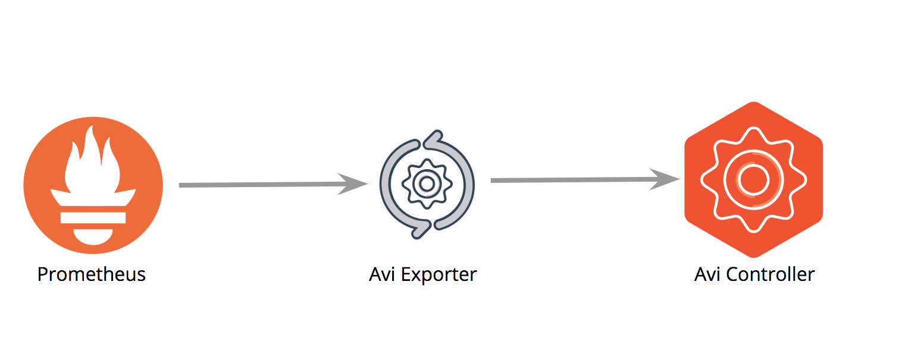

# Overview

Prometheus is an open-source systems monitoring and alerting toolkit that joined the Cloud Native Computing Foundation (CNCF) in 2016.  Unlike other common monitoring solutions, Prometheus metrics collection happens via a pull model utilizing HTTP.

Although Avi Vantage provides a rich user interface for viewing performance metrics, a lot of enterprises desire to centralize their data into as few tools as possible, Prometheus commonly being one of these.

Avi Networks provides a container based exporter that Prometheus will scrape (pull) for retrieving desired metrics for the specified entity types.  With close to 800 unique metrics available from the Avi Controller, the Avi exporter enables an enterprise to centralize their metrics data without sacrificing the immense visibiltiy into how their applications are performing.

This article will discuss how the exporter works and provide example prometheus.yml job configuration examples for capturing the metrics for the different entity types.

<a href="https://prometheus.io/">More info on Prometheus</a>


## Traffic Flow

The Avi exporter pulls the desired metrics from the Avi Controller and serves as the scrape target for Prometheus.  The exporter returns metric data once an HTTP request from Prometheus has been received.  <strong>The exporter returns metric data results as 5 min averages from the controller.</strong> 


<figure>
<figcapture>
<b>Figure 1.</b>
<a href="img/img1.png"></a>
</figcapture>
</figure>


## How the Exporter Works

The Avi exporter provides a single endpoint supporting multiple entity types; dependent upon configurable HTTP parameters specific metrics for specific entities will be returned.  The available entity types are <strong>virtualservice, serviceengine, pool</strong> and <strong>controller</strong>.  More specific information on how these can be used and what data is returned will be covered below in the subsequent sections.  <strong>The Avi exporter caches the metrics for a configurable time period.</strong>  During this period any request received by the exporter will return values from the cache.  The exporter will not proactively refresh the metrics cache, metrics cache updates are triggered by Prometheus requests.  The intent for the exporter caching the metrics is to rate limit API calls to the Avi controller and in some scenarios eliminate Prometheus scrape timeouts while awaiting for the metrics queries to be returned from the Avi Controller.

Here are a few common scenarios and what behavior can be expected:

### Prometheus request with empty cache in exporter
When a request is received by the exporter, if there are no cached metrics the exporter will return an empty repsonse and update the metrics cache in the background.  This situation is usual when the exporter is initially created.


### Prometheus request with populated cache in exporter
When a request is received by the exporter and there are cached metrics the exporter will return the requested metrics from the cache.

### Prometheus request with an expired populated cache in exporter
When a request is received and there are cached metrics in the exporter that are older then the retention period, the requested metrics will be immediately returned from the current cache and in the background the cache will be upgraded.  


## How to Use the Exporter

The exporter is provided as a container located at <a href="https://cloud.docker.com/u/avinetworks/repository/docker/avinetworks/avi_exporter">https://cloud.docker.com/u/avinetworks/repository/docker/avinetworks/avi_exporter</a>.  In the following section the required variable values will be desribed and then two examples for running the exporter are provided; on a stand alone Docker host, and deploying within Kubernetes/Openshift.
<strong>
- URL path:  /metrics
- Listening Port: 8080
- Protocol:  HTTP
</strong>

### Running the Exporter
The exporter requires passing values via environment variables to specify the Avi Controller to pull metrics from and credentials that will be used for authentication.  Below is a list of what variables are available and which ones are required.

 <table class="table table table-bordered table-hover">  
 <tbody>       
 <tr>   
 <th>ENVIRONMENT VARIABLE
 </th>
 <th>DESCRIPTION
 </th>
  <th>REQUIRED
 </th>
 </tr>
 <tr>    
 <td><strong>AVICONTROLLER</strong></td>
 <td>FQDN or IP address of the Avi Controller that the exporter will be pulling metrics from</td>
 <td>YES</td>
 </tr>
 <tr>    
 <td><strong>AVIUSER</strong></td>
 <td>Username that will be used to authenticate to the Avi Controller</td>
 <td>YES</td>
 </tr>
  <tr>    
 <td><strong>AVIPASSWORD</strong></td>
 <td>Password for the username that will be used for authentication</td>
 <td>YES</td>
 </tr>
 <tr>    
 <td><strong>EN_METRIC_REFRESH_INTERVAL</strong></td>
 <td>Time in seconds that metrics will be cached on the exporter before being refreshed</td>
 <td>NO, default value is 300, minimum value is 60</td>
 </tr>
 </tbody>
 </table>

<br></br>
#### User Role Permissions
The user being utilized for retrieving metrics will require READ priviliges on numerous objects dependent upon which entity types values are being pulled for.  The table below specifies the minimum required objects for which READ privileges must be enabled.

<i>Note: If creating the role from the UI, notifications will be raised for additional objects that will require READ privileges prior to allowing for enabling Virtual Service or Pool permissions. </i>


<a href="https://avinetworks.com/docs/18.2/user-account-roles/">Avi Vantage User Roles</a>


<br></br>
 <table class="table table table-bordered table-hover">  
 <tbody>       
 <tr>   
 <th>ENTITY TYPE</th>
 <th>TENANT</th>
 <th>OBJECTS</th>
 </tr>
 <tr>    
 <td><strong>virtualservice</strong></td>
 <td>variable, role must be applied to tenants for which virtualservice metrics will be retrieved from</td>
 <td>Cloud, VRF Context, Virtual Service</td>
 </tr>
 <tr>    
 <td><strong>serviceengine</strong></td>
 <td>variable, role  must be applied to tenants for which serviceengine metrics will be retrieved from</td>
 <td>Service Engine</td>
 </tr>
  <tr>    
 <td><strong>pool</strong></td>
 <td>variable, role must be applied to tenants for which pool metrics will be retrieved from</td>
 <td>Cloud, VRF Context, Virtual Service, Pool</td>
 </tr>
  <tr>    
 <td><strong>controller</strong></td>
 <td>Admin</td>
 <td>Controller</td>
 </tr>
 </tbody>
 </table>


<br></br>
#### Example 1. Running on standalone host


<pre><code>
> docker run -d -e "AVICONTROLLER=169.254.0.1" -e "AVIUSER=admin" -e "AVIPASSWORD=password" -p 80:8080/tcp --name avi_exporter avinetworks/avi_exporter:latest
</code></pre>

<br></br>


#### Example 2. Deploying in Kubernetes/Openshift

While deploying the exporter within Kubernetes/Openshift it is recommended to deploy the exporter as a replicationcontroller and provide the Controller and login credentials utilizing secrets.  Below are yml examples for the secrets and replicationcontroller with service.  For further information please see the following links.

<a href="https://kubernetes.io/docs/concepts/configuration/secret/">https://kubernetes.io/docs/concepts/configuration/secret/</a>

<a href="https://kubernetes.io/docs/concepts/workloads/controllers/replicationcontroller/">https://kubernetes.io/docs/concepts/workloads/controllers/replicationcontroller/</a>


<strong>SECRET</strong>
<pre><code>
apiVersion: v1
kind: Secret
metadata:
  name: avicredentials
type: Opaque
data:
  controller: MTY5LjI1NC4wLjE=
  user: YWRtaW4=
  password: cGFzc3dvcmQ=
</code></pre>

<br></br>
<strong>REPLICATION CONTROLLER</strong>
<pre><code>
apiVersion: v1
kind: ReplicationController
metadata:
  name: avi_exporter
spec:
  replicas: 1
  selector:
    name: avi_exporter
  template:
    metadata:
      name: avi_exporter
      labels:
        name: avi_exporter
    spec:
      containers:
      - name: avi_exporter
        image: avinetworks/avi_exporter:latest
        imagePullPolicy: Always
        ports:
        - containerPort: 8080
          protocol: TCP
        env:
          - name: AVICONTROLLER
            valueFrom:
              secretKeyRef:
                name: avicredentials
                key: controller
          - name: AVIUSER
            valueFrom:
              secretKeyRef:
                name: avicredentials
                key: user
          - name: AVIPASSWORD
            valueFrom:
              secretKeyRef:
                name: avicredentials
                key: password                                
          - name: EN_METRIC_REFRESH_INTERVAL
            value: '300'


---
apiVersion: v1
kind: Service
metadata:
  labels:
    svc: avi_exporter
  name: avi_exporter
  namespace: demo
spec:
  ports:
  - name: http
    port: 80
    protocol: TCP
    targetPort: 8080
  selector:
    name: avi_exporter
  sessionAffinity: None
  type: ClusterIP
status:
  loadBalancer: {}
</code></pre>


<br></br>

### Labels Returned per Entity Type

For each different entity type there will be a specific set of labels being returned.  In the tables below, a listing of what labels are returned and brief description about what the value is.
<br></br>

#### VIRTUALSERVICE

<strong>Example:</strong><br></br>
l4_client_avg_bandwidth{cloud="Default-Cloud",entity_type="virtualservice",name="demo-vs",tenant="demo",uuid="virtualservice-b7affd78-0bb2-45a8-993a-11ba70fc774c"}

 <table class="table table table-bordered table-hover">  
 <tbody>       
 <tr>   
 <th>LABEL
 </th>
 <th>DESCRIPTION
 </th>
 </tr>
 <tr>    
 <td><strong>cloud</strong></td>
 <td>Name of the Cloud the virtualservice is a member of</td>
 </tr>
  <tr>    
 <td><strong>entity_type</strong></td>
 <td>Type of entity the metric is for, in this case the value would be virtualservice</td>
 </tr>
 <tr>    
 <td><strong>name</strong></td>
 <td>Name of the virtualservice</td>
 </tr>
 <tr>    
 <td><strong>tenant</strong></td>
 <td>Name of the tenant the virtualservice is a member of</td>
 </tr>
 <tr>    
 <td><strong>uuid</strong></td>
 <td>UUID of the virtualservice</td>
 </tr>
 </tbody>
 </table>

<br></br>
<br></br>

 #### SERVICEENGINE

<strong>Example:</strong><br></br>
se_if_avg_bandwidth{cloud="Default-Cloud",entity_type="serviceengine",name="AviDemo-se-dcsob",tenant="admin",uuid="se-00505682a54f"}

 <table class="table table table-bordered table-hover">  
 <tbody>       
 <tr>   
 <th>LABEL
 </th>
 <th>DESCRIPTION
 </th>
 </tr>
 <tr>    
 <td><strong>entity_type</strong></td>
 <td>Type of entity the metric is for, in this case the value would be serviceengine</td>
 </tr>
 <tr>    
 <td><strong>name</strong></td>
 <td>Name of the serviceengine</td>
 </tr>
  <tr>    
 <td><strong>se_group</strong></td>
 <td>Name of the se_group the serviceengine is a member of</td>
 </tr>
 <tr>    
 <td><strong>tenant</strong></td>
 <td>Name of the tenant the serviceengine is a member of</td>
 </tr>
 <tr>    
 <td><strong>uuid</strong></td>
 <td>UUID of the serviceengine</td>
 </tr>
 </tbody>
 </table>

<br></br>
<br></br>

 #### CONTROLLER

 <strong>Example:</strong><br></br>
controller_stats_avg_cpu_usage{entity_type="controller",name="169.254.0.1",vm_uuid="005056b8e868"}

 <table class="table table table-bordered table-hover">  
 <tbody>       
 <tr>   
 <th>LABEL
 </th>
 <th>DESCRIPTION
 </th>
 </tr>
 <tr>    
 <td><strong>entity_type</strong></td>
 <td>Type of entity the metric is for, in this case the value would be controller</td>
 </tr>
 <tr>    
 <td><strong>name</strong></td>
 <td>Name or IP of the specific controller</td>
 </tr>
  <tr>    
 <td><strong>vm_uuid</strong></td>
 <td>UUID of the controller</td>
 </tr>
 </tbody>
 </table>

<br></br>
<br></br>

#### POOL

<strong>Example:</strong><br></br>
l4_server_avg_rx_pkts{cloud="Default-cloud",entity_type="pool",name="temp-pool-9090-tcp",server="169.254.0.10:9090",tenant="default",uuid="pool-6373446c-2cbb-4554-a580-78593870391c"}

 <table class="table table table-bordered table-hover">  
 <tbody>       
 <tr>   
 <th>LABEL
 </th>
 <th>DESCRIPTION
 </th>
 </tr>
 <tr>    
 <td><strong>cloud</strong></td>
 <td>Name of the Cloud the pool is a member of</td>
 </tr>
  <tr>    
 <td><strong>entity_type</strong></td>
 <td>Type of entity the metric is for, in this case the value would be pool</td>
 </tr>
 <tr>    
 <td><strong>name</strong></td>
 <td>Name of the pool</td>
 </tr>
  <tr>    
 <td><strong>server</strong></td>
 <td>The specific pool server the metric values is for</td>
 </tr>
 <tr>    
 <td><strong>tenant</strong></td>
 <td>Name of the tenant the pool is a member of</td>
 </tr>
 <tr>    
 <td><strong>uuid</strong></td>
 <td>UUID of the pool</td>
 </tr>
 </tbody>
 </table>


 ### Prometheus Job Configurations

 The Avi exporter uses HTTP parameters within the Prometheus request to provide the desired data.  Below is a list of job options that can be configured within Prometheus for pulling metrics.

 - virtualservice
 - virtualservice Service Discovery (Kubernetes/Openshift)
    - <a href="https://prometheus.io/docs/prometheus/latest/configuration/configuration/#kubernetes_sd_config">Prometheus Service Discovery</a>
 - serviceengine
 - pool
 - controller

For each job configuration parameters will need to be provided within the prometheus config.  Below is a table of the available parameters.

<table class="table table table-bordered table-hover">  
<tbody>       
<tr>   
 <th>JOB TYPE</th>
 <th>PARAMETER</th>
 <th>DESCRIPTION</th>
 <th>REQUIRED</th>
</tr>
<tr>
 <td><strong>virtualservice</strong></td>
 <td>entity_type</td>
 <td>Type of entity that metrics are desired for, in this case it would be <strong>virtualservice</strong></td>
 <td>YES</td>
 </tr>
<tr>
 <td><strong></strong></td>
 <td>entity_uuid</td>
 <td>UUID(s) for which virtualservice(s) metrics are desired for</td>
 <td>NO, defaults to ALL</td>
 </tr>
<tr>
 <td><strong></strong></td>
 <td>metric_id</td>
 <td>Which specific metric(s) to be retrieved</td>
 <td>NO, if no metrics defined defaults to predefined list. See end of article for default metric lists</td>
 </tr>
<tr>
 <td><strong></strong></td>
 <td>tenant</td>
 <td>Which tenant(s) to pull metrics for</td>
 <td>NO, defaults to ALL</td>
 </tr>
<tr>
 <td><strong></strong></td>
 <td>cloud</td>
 <td>Which cloud(s) to pull metrics for</td>
 <td>NO, defaults to ALL</td>
 </tr>
 <tr bgcolor="#F3F3F3">
 <td></td>
 <td></td>
 <td></td>
 <td></td>
 </tr>
<tr>
 <td><strong>Service Discovery (Kubernetes/Openshift)</strong></td>
 <td>entity_type</td>
 <td>Type of entity that metrics are desired for, in this case it would be <strong>virtualservice</strong></td>
 <td>YES</td>
 </tr>
<tr>
 <td><strong></strong></td>
 <td>metric_id</td>
<td>Which specific metric(s) to be retrieved</td>
 <td>NO, if no metrics defined defaults to predefined list. See end of article for default metric lists</td>
 </tr>
 <tr bgcolor="#F3F3F3">
 <td></td>
 <td></td>
 <td></td>
 <td></td>
 </tr>
<tr>
 <td><strong>serviceengine</strong></td>
 <td>entity_type</td>
 <td>Type of entity that metrics are desired for, in this case it would be <strong>serviceengine</strong></td>
 <td>YES</td>
 </tr>
<tr>
 <td><strong></strong></td>
 <td>entity_uuid</td>
 <td>UUID(s) for which serviceengine(s) metrics are desired for</td>
 <td>NO, defaults to ALL</td>
 </tr>
<tr>
 <td><strong></strong></td>
 <td>metric_id</td>
<td>Which specific metric(s) to be retrieved</td>
 <td>NO, if no metrics defined defaults to predefined list. See end of article for default metric lists</td>
 </tr>
<tr>
 <td><strong></strong></td>
 <td>tenant</td>
 <td>Which tenant(s) to pull metrics for</td>
 <td>NO, defaults to ALL</td>
 </tr>
<tr>
 <td><strong></strong></td>
 <td>cloud</td>
 <td>Which cloud(s) to pull metrics for</td>
 <td>NO, defaults to ALL</td>
 </tr>
 <tr bgcolor="#F3F3F3">
 <td></td>
 <td></td>
 <td></td>
 <td></td>
 </tr>
<tr>
 <td><strong>pool</strong></td>
 <td>entity_type</td>
 <td>Type of entity that metrics are desired for, in this case it would be <strong>pool</strong></td>
 <td>YES</td>
 </tr>
<tr>
 <td><strong></strong></td>
 <td>entity_uuid</td>
 <td>UUID(s) for which pool(s) metrics are desired for</td>
 <td>NO, defaults to ALL</td>
 </tr>
<tr>
 <td><strong></strong></td>
 <td>metric_id</td>
<td>Which specific metric(s) to be retrieved</td>
 <td>NO, if no metrics defined defaults to predefined list. See end of article for default metric lists</td>
 </tr>
<tr>
 <td><strong></strong></td>
 <td>tenant</td>
 <td>Which tenant(s) to pull metrics for</td>
 <td>NO, defaults to ALL</td>
 </tr>
<tr>
 <td><strong></strong></td>
 <td>cloud</td>
 <td>Which cloud(s) to pull metrics for</td>
 <td>NO, defaults to ALL</td>
 </tr>
 <tr bgcolor="#F3F3F3">
 <td></td>
 <td></td>
 <td></td>
 <td></td>
 </tr>
<tr>
 <td><strong>controller</strong></td>
 <td>entity_type</td>
 <td>Type of entity that metrics are desired for, in this case it would be <strong>controller</strong></td>
 <td>YES</td>
 </tr>
<tr>
 <td><strong></strong></td>
 <td>metric_id</td>
<td>Which specific metric(s) to be retrieved</td>
 <td>NO, if no metrics defined defaults to predefined list. See end of article for default metric lists</td>
 </tr>
 </tbody>
 </table>


### Prometheus Configuration Examples
Below are Prometheus job configuration examples for the different job types.  The target for all the job configurations needs to be the Avi exporter itself.
<br></br><strong>NOTE:</strong>When providing a list, it must be formatted as comma separated with the entire string enclosed in a single set of quotes.
* * *

#### Virtualservice
```
- job_name: 'avi_virtualservice'
  scrape_interval: 60s
  scrape_timeout: 30s
  metrics_path: /metrics
  params:
      tenant: []
      entity_uuid: ['virtualservice-c312818c-8d71-49f2-8320-9027f6884ed5,
                    virtualservice-62aee690-dcd3-4c0a-b724-1e36d2666bc6,
                    virtualservice-985b3f40-5b17-4f12-bb0c-c6ededdda35a,
                    virtualservice-26df98b9-a82e-4ed4-9e73-b48c6df11b9f']
      metric_id: ['l4_client.avg_bandwidth,
                  l4_client.avg_complete_conns,
                  l4_client.avg_new_established_conns,
                  l4_client.avg_rx_pkts,
                  l4_client.avg_tx_pkts,
                  l4_client.avg_rx_bytes,
                  l4_client.avg_tx_bytes,
                  l7_client.avg_resp_2xx,
                  l7_client.avg_resp_4xx,
                  l7_client.avg_resp_5xx,
                  l4_client.avg_total_rtt']
      entity_type: ['virtualservice']
      cloud: []
  scheme: http
  static_configs:
  - targets: ['avi-prometheus.default.svc:80']
```

* * *

#### Virtualservice Service Discovery

As an alternative to the previous example, Prometheus can integrate with Kuberenets to dynamically discover when new services/ingress are deployed.  If using service discovery is desired it is important to be able to differentiate services/ingresses that are deployed as Avi Virtual Services and services/ingresses that are not.  Job configurations for East/West (service) vs North/South (ingress, Kubernetes ONLY) will differ.  Service discovery for North South is not supported for Openstack deployments, North South virtual services user Routes and Prometheus does not support discoverying Routes.

Using Prometheus' Service Discovery mechanism allows for the administrators ability to enable/disable metrics collection for a virtualservice by using Kubernetes annotations.  

<strong>The metric_id parameter applies for all services that are discovered.  If it's desired to retrieve additional metrics for specific services an optional annotation is available.  This annotation is <i>"avimetrics"</i>.  The value will be a list of metrics in the same format as the metric_id parameter.</strong>

<strong>East West Service</strong>

In example provided the very first entry within relabel_configs looks for services with two annotations with specific values:
- <strong>avi_prometheus</strong> equals "true"
- <strong>avi_proxy</strong> contains: "east_west_placement\": true,

Any service that has annotations that match will have their metrics retrieved from the exporter.

The last line of the configuration defines that target to be the exporter.


```
- job_name: 'avi_virtualservice_sd'
  scrape_interval: 60s
  scrape_timeout: 30s
  metrics_path: /metrics
  params:
      metric_id: ['l4_client.avg_bandwidth,l4_client.avg_complete_conns']
      entity_type: ['virtualservice']
  scheme: http
  kubernetes_sd_configs:
  - role: service
  relabel_configs:
    - source_labels: [__meta_kubernetes_service_annotation_avi_prometheus,__meta_kubernetes_service_annotation_avi_proxy]
      action: keep
      regex: 'true;.*\"east_west_placement\":\s?true,.*'
    - source_labels: [__meta_kubernetes_namespace]
      target_label: __param_kubernetes_namespace
    - source_labels: [__meta_kubernetes_service_name]
      target_label: __param_virtualservice
    - source_labels: [__meta_kubernetes_service_annotation_avimetrics]
      target_label: __param_extra_metrics
    - source_labels: [__address__]
      target_label: instance 
    - source_labels: [__address__]
      regex: (.+):(\d+)
      target_label: __address__
      replacement: avi-prometheus.default.svc:80
```

<strong>North South Ingress</strong>


In this next example provided the very first entry within relabel_configs looks for ingress with a specific annotation with a specific value:
- <strong>avi_prometheus</strong> equals "true"

<strong>Based upon Avi ingress virtualservice naming conventions, it is required to define the north south domain name being used for the __subdomain label.  In the example below the domain being used is ns.avi</strong>

Any ingress that has an annotation that matches will have their metrics retrieved from the exporter.

The last line of the configuration defines that target to be the exporter.

```
- job_name: 'avi_ingress'
  scrape_interval: 60s
  scrape_timeout: 30s
  metrics_path: /metrics
  params:
      metric_id: ['l4_client.avg_bandwidth,l4_client.avg_complete_conns']
      entity_type: ['virtualservice']
  scheme: http
  kubernetes_sd_configs:
  - role: ingress
  relabel_configs:
    - source_labels: [__meta_kubernetes_ingress_annotation_avi_prometheus]
      action: keep
      regex: true
    - target_label: __subdomain
      replacement: ns.avi
    - source_labels: [__meta_kubernetes_namespace]
      target_label: __param_kubernetes_namespace
    - source_labels: [__meta_kubernetes_ingress_name,__meta_kubernetes_namespace,__subdomain]
      regex: (.+);(.+);(.+)
      replacement: $1.$2.$3
      target_label: __param_virtualservice
    - source_labels: [__meta_kubernetes_ingress_annotation_avimetrics]
      target_label: __param_extra_metrics
    - source_labels: [__meta_kubernetes_ingress_name]
      target_label: instance
    - source_labels: [__address__]
      regex: (.+)
      target_label: __address__
      replacement: avi-prometheus.default.svc:80
```

* * *

#### Serviceengine
```
- job_name: 'avi_serviceengine'
  scrape_interval: 60s
  metrics_path: /metrics
  params:
      tenant: ['demo,admin']
      entity_uuid: []
      metric_id: ['se_if.avg_bandwidth,se_stats.avg_cpu_usage']
      entity_type: ['serviceengine']
      cloud: []
  scheme: http
  static_configs:
  - targets: ['avi-prometheus.default.svc:80']
```


* * *

#### Pool
```
- job_name: 'avi_pool'
  scrape_interval: 60s
  scrape_timeout: 30s
  metrics_path: /metrics
  params:
      tenant: []
      entity_uuid: []
      metric_id: []
      entity_type: ['pool']
      cloud: ['Default-cloud,AWS-cloud']
  scheme: http
  static_configs:
  - targets: ['avi-prometheus.default.svc:80']
```

<br></br>

## DEFAULT METRICS LIST


### Default Virtual Service Metrics
    - l4_client.apdexc
    - l4_client.avg_bandwidth
    - l4_client.avg_application_dos_attacks
    - l4_client.avg_complete_conns
    - l4_client.avg_connections_dropped
    - l4_client.avg_new_established_conns
    - l4_client.avg_policy_drops
    - l4_client.avg_rx_pkts
    - l4_client.avg_tx_pkts
    - l4_client.avg_rx_bytes
    - l4_client.avg_tx_bytes
    - l4_client.max_open_conns
    - l4_client.avg_lossy_connections
    - l7_client.avg_complete_responses
    - l7_client.avg_client_data_transfer_time
    - l7_client.avg_client_txn_latency
    - l7_client.sum_application_response_time
    - l7_client.avg_resp_4xx_avi_errors
    - l7_client.avg_resp_5xx_avi_errors
    - l7_client.avg_resp_2xx
    - l7_client.avg_resp_4xx
    - l7_client.avg_resp_5xx
    - l4_client.avg_total_rtt
    - l7_client.avg_page_load_time
    - l7_client.apdexr
    - l7_client.avg_ssl_handshakes_new
    - l7_client.avg_ssl_connections
    - l7_client.sum_get_reqs
    - l7_client.sum_post_reqs
    - l7_client.sum_other_reqs
    - l7_client.avg_frustrated_responses
    - l7_client.avg_waf_attacks
    - l7_client.pct_waf_attacks
    - l7_client.sum_total_responses
    - l7_client.avg_waf_rejected
    - l7_client.avg_waf_evaluated
    - l7_client.avg_waf_matched
    - l7_client.avg_waf_disabled
    - l7_client.pct_waf_disabled
    - l7_client.avg_http_headers_count
    - l7_client.avg_http_headers_bytes
    - l7_client.pct_get_reqs
    - l7_client.pct_post_reqs
    - l7_client.avg_http_params_count
    - l7_client.avg_uri_length
    - l7_client.avg_post_bytes
    - dns_client.avg_complete_queries
    - dns_client.avg_domain_lookup_failures
    - dns_client.avg_tcp_queries
    - dns_client.avg_udp_queries
    - dns_client.avg_udp_passthrough_resp_time
    - dns_client.avg_unsupported_queries
    - dns_client.pct_errored_queries
    - dns_client.avg_domain_lookup_failures
    - dns_client.avg_avi_errors
    - dns_server.avg_complete_queries
    - dns_server.avg_errored_queries
    - dns_server.avg_tcp_queries
    - dns_server.avg_udp_queries
    - l4_server.avg_rx_pkts
    - l4_server.avg_tx_pkts
    - l4_server.avg_rx_bytes
    - l4_server.avg_tx_bytes
    - l4_server.avg_bandwidth
    - l7_server.avg_complete_responses
    - l4_server.avg_new_established_conns
    - l4_server.avg_pool_open_conns
    - l4_server.avg_pool_complete_conns
    - l4_server.avg_open_conns
    - l4_server.max_open_conns
    - l4_server.avg_errored_connections
    - l4_server.apdexc
    - l4_server.avg_total_rtt
    - l7_server.avg_resp_latency
    - l7_server.apdexr
    - l7_server.avg_application_response_time
    - l7_server.pct_response_errors
    - l7_server.avg_frustrated_responses
    - l7_server.avg_total_requests      
    - healthscore.health_score_value      

* * *

### Default Service Engine Metrics       
    - se_if.avg_bandwidth
    - se_stats.avg_connection_mem_usage
    - se_stats.avg_connections
    - se_stats.avg_connections_dropped
    - se_stats.avg_cpu_usage
    - se_stats.avg_disk1_usage
    - se_stats.avg_mem_usage
    - se_stats.avg_dynamic_mem_usage
    - se_stats.avg_persistent_table_usage
    - se_stats.avg_rx_bandwidth
    - se_if.avg_rx_bytes
    - se_if.avg_rx_pkts
    - se_if.avg_rx_pkts_dropped_non_vs
    - se_if.avg_tx_pkts
    - se_if.avg_tx_bytes
    - se_stats.avg_ssl_session_cache_usage
    - se_if.avg_connection_table_usage
    - se_stats.max_se_bandwidth
    - se_stats.avg_eth0_bandwidth
    - se_stats.pct_syn_cache_usage
    - se_stats.avg_packet_buffer_usage
    - se_stats.avg_packet_buffer_header_usage
    - se_stats.avg_packet_buffer_large_usage
    - se_stats.avg_packet_buffer_small_usage
    - healthscore.health_score_value

* * *

### Default Controller Metrics            
    - controller_stats.avg_cpu_usage
    - controller_stats.avg_disk_usage
    - controller_stats.avg_mem_usage


* * *

### Default Pool Metrics
    - l4_server.avg_rx_pkts
    - l4_server.avg_tx_pkts
    - l4_server.avg_rx_bytes
    - l4_server.avg_tx_bytes
    - l4_server.avg_bandwidth
    - l7_server.avg_complete_responses
    - l4_server.avg_new_established_conns
    - l4_server.avg_pool_open_conns
    - l4_server.avg_pool_complete_conns
    - l4_server.avg_open_conns
    - l4_server.max_open_conns
    - l4_server.avg_errored_connections
    - l4_server.apdexc
    - l4_server.avg_total_rtt
    - l7_server.avg_resp_latency
    - l7_server.apdexr
    - l7_server.avg_application_response_time
    - l7_server.pct_response_errors
    - l7_server.avg_frustrated_responses
    - l7_server.avg_total_requests
    - healthscore.health_score_value
    